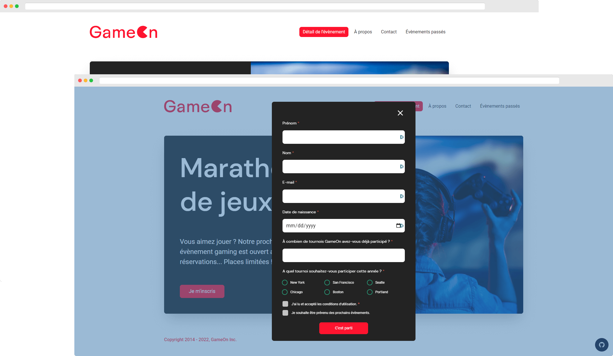

# GameOn



## Overview

The project was to create a form validation system.

## Issues

- [x] Close the modal
- [x] Implement form entries
- [x] Add success or error messages
- [x] Add confirmation when sending successfully
- [x] Test manuals

## Local Development

1. Clone the repository

```sh
git clone https://github.com/alexperronnet/openclassrooms-p4-gameon.git
```

2. Navigate to the repository

```sh
cd openclassrooms-p4-gameon
```

3. Install dependencies

```sh
npm install
```

4. Start the development server

```sh
npm run dev
```

5. Genrate production build

```sh
npm run build
```

6. Preview the production

```sh
npm run preview
```

---

See the [live URL](https://alexperronnet.github.io/openclassrooms-p4-gameon/)
